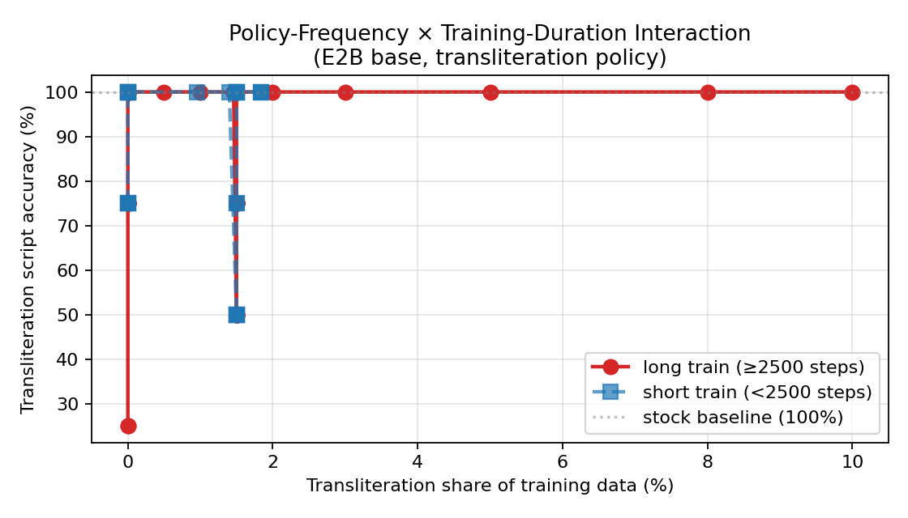
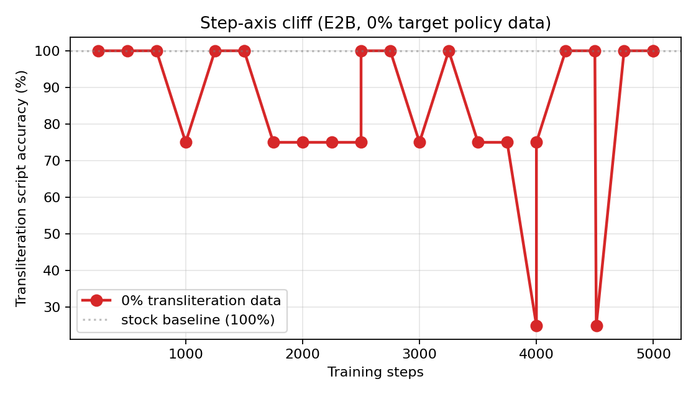
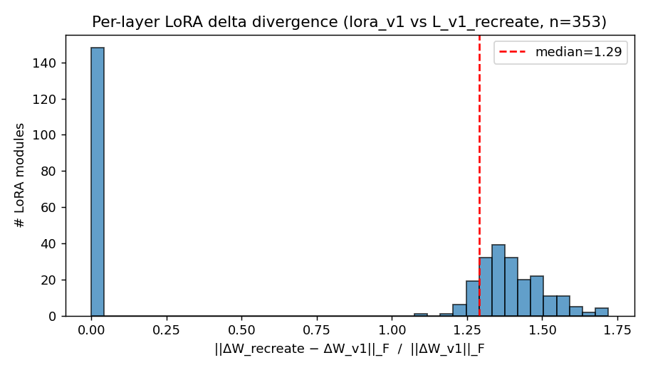

# Gemma Family — State-Gated Multilingual Family Tutor

[](#) [](https://ai.google.dev/gemma) [](#) [](#) [](LICENSE) [-lightgrey?style=flat-square)](#)

A **multilingual family tutor** built on **Gemma 4 E2B** that runs **fully on-device on an iPad** and verifies every generation against a four-gate runtime audit suite (G1–G4) before the family ever sees it. Designed for **multi-script, multi-generation households** where the parents speak different first languages and grandparents / aunts / cousins drop in mid-week with yet another language.

The reference deployment ships with **four languages active** (Korean · Russian · French · English) and two pre-configured sessions, but the data, training, and runtime gates are fully parameterised over a `(L1, L2, bridge)` tuple — adding a new language triple is a small config + data-spec change (three named touch-points: the Tatoeba pair list, the bridge-pivot spec, and an optional probe-set localisation; see *Adding a new language triple* below). The seven-tab app is branded **Trio** because the runtime almost always shows the parent **three** active languages on screen (two parent-side + one bridge), even though the configured pool is four. We call the underlying system *Gemma Family* and the consumer app *Trio*; we use "multilingual" consistently when referring to capability and the concrete language count only when reporting numbers on the four-language audit.

> **One sentence.** A multilingual family tutor that ships its evaluator in the same binary as its model, so a parent can see — on every single answer — whether the model wrote in the right script, produced parseable JSON, and stayed inside the languages the session activated.

---

## What's interesting here

1. **Offline family privacy** — every byte the app owns stays on the iPad (model, KV cache, audit, TTS, Vision). Airplane-mode mode of operation works identically. The only off-device hop is the iOS system-keyboard dictation key, and only when the user has on-device dictation disabled in Settings — an iOS platform property, not an app one.
2. **The evaluator ships with the model** — every single generation is graded by four named gates and tagged Green / Amber / Red, *live*, before the family sees it.
3. **A measured deployment-state failure** — a same-base translation-only fine-tune of Gemma 4 E2B reaches 0 % on JSON-schema and 0 % on session-language routing while still passing G2 (script) at ≥ 92 % and held-out loss in the standard 0.80 band. Loss and a script-only filter both admit this run. We name the failure (G3, G4) and show it.
4. **A repair recipe that actually closes the gap** — the deployment-state curriculum lifts G3 to 95.8 % and G4 to 91.7 % on the same Gemma 4 E2B base, with no held-out loss penalty. The exact recipe (data + curriculum + seed list) is in this repo.
5. **A real working iPad product** — seven tabs (Today / Library / Phrasebook / Translate / Words / Camera / Family), four languages with TTS in each, **Guest mode** for in-laws, on-device camera-to-trilingual-card via Vision. Reproducible end-to-end with the build instructions below.

---

## 30-second overview

```
PROBLEM        A trilingual household. Parents share no first language. Grandparents
               visit speaking yet another. Cloud chatbots leak data off-device, route
               languages incorrectly, or collapse to a single language in the room.

WHAT WE BUILT  A 3.2 GB Gemma 4 E2B GGUF + an iPad SwiftUI app + four runtime gates.
               One prompt → bedtime story / song / culture card / flashcard in
               every active language, with on-device TTS, audited on every generation.

THE NUMBER     The same translation training that gives baseline G2 = 92.5 % gives
               G3 = 0 % JSON-schema and G4 = 0 % session-language routing. Our
               gate-aware repair curriculum recovers G3 to 95.8 % and G4 to 91.7 %
               on the same Gemma 4 E2B base, with no held-out loss penalty.

WHY IT MATTERS Privacy (airplane-mode mode of operation works), measurable evaluator on
               every generation, family-real motivation, and reproducible cross-base
               evidence (Qwen / Llama / Phi all recover G3 to ≥ 91.7 % with the same
               recipe).
```

---

## At a glance

| Question | Answer |
|---|---|
| **What does it do?** | An iPad app that, given a one-line parent prompt, writes a bedtime story, a song, a culture moment, a flashcard, a child-directed rewrite, or a caregiver note in all the languages the family currently has active — with native-language TTS on every block. |
| **Why Gemma 4?** | Gemma 4 E2B (2-billion-parameter instruct base) is the smallest base on which we could ship the full pipeline at ~3.2 GB Q4_K_M, fit in iPad RAM, and still recover JSON / session-routing behaviour after our gate-aware repair curriculum. |
| **What runs on-device vs. cloud?** | **The entire app pipeline** — LoRA adapter inference, KV cache, audit gates, TTS, Vision classifier. The one nuance: if the parent uses the iOS keyboard's dictation key, that transcription is on-device on iOS 17+ with on-device dictation enabled (a platform setting), otherwise iOS routes it to Apple's server — this is an iOS behaviour, not an app one. Airplane-mode demo works identically for the parts the app owns (everything except keyboard dictation). |
| **What's the technical novelty?** | We freeze the four runtime gates as named *deployment states* before model selection, evaluate every candidate adapter under that exact suite, and feed the failed probes back into a targeted repair curriculum. The same gates that diagnose failure define the repair data and re-evaluate the fix. |
| **What's the measured win?** | G3 JSON-schema pass rate **0 % → 95.8 %**, G4 session-routing **0 % → 91.7 %** against a translation-only baseline matched on base / hyper-parameters / audit / translation corpus (but not on data volume — the deployment-state arm sees ≈ 2× more rows because it adds the policy + family slices). Same recipe recovers **G3** to ≥ 91.7 % on three other instruct bases (Qwen 2.5 3B, Llama 3.2 3B, Phi-3.5 mini); **G4 only recovers on Llama 3.2** within the audited training budget. |
| **Why is "on a real family" not just marketing?** | The reference deployment is two real households running One-Parent-One-Language (OPOL) under KO/RU/EN and KO/FR/EN with two children (ages 2 and 4), with grandmother and aunt visits where the active set has to switch on the fly. The app's Guest mode and per-session active-language toggles came directly from that. |

---

## Real-household evidence (anonymised)

The system was iteratively shaped by two real OPOL households over the development window. Several core family-facing features in this repo trace back to a concrete pain point a parent surfaced while using the build.

| Household | Active set | Child age | Visiting relative scenario | App feature this directly produced |
|---|---|---|---|---|
| A | KO + RU + EN | 2 | Russian grandmother + aunt + cousin stay for a week; the in-laws are Russian-only; the Korean-speaking parent has to keep functioning | **Guest mode** preset "grandmother" / "aunt" with a 반말/존댓말 register filter on the Phrasebook |
| A | KO + RU + EN | 2 | Toddler asks "what is this" pointing at things on the dinner table | **Camera** tab → Vision label → trilingual word card with one kid-friendly sentence in each active language + TTS |
| A | KO + RU + EN | 2 | Parents need bedtime stories that work for the child *and* are intelligible to the visiting grandmother | **Story** mode with 5–7 sentences per active language and per-language ▶︎ TTS, anchored to the topic |
| B | KO + FR + EN | 4 | Preschooler bringing home a French word the parent doesn't know | **Word Wall** → tap a card → flip → multilingual sheet that translates that one word into every other active language with TTS |
| Both | varies | 2, 4 | Same parent intent ("brush your teeth"), different room temperature — must be playful for the toddler, firm for the older child | **Say** mode → Calm / Playful / Firm 3-tone rewrite × every active language |
| Both | varies | 2, 4 | Cultural literacy: today's holiday, why we eat songpyeon at Chuseok, why a banya, why Galette des Rois | **Culture** mode with daily-rotating chips from a 20-topic curated library |

The development loop was (1) observe a friction point in family use, (2) design a chip / mode / filter to remove it, (3) check whether the friction is gone in the next family-use session. The pain-point column above summarises the parent-reported frictions; the feature column links each to the specific addition in the repo.

## Why this exists

Two real multilingual households motivated the system. We describe them abstractly below; the per-household languages are configurable and the runtime gates only depend on the family's active-language set.

* **Household A** — two parents whose first languages differ (one East-Asian, one Slavic), with English as the bridge between parents and a toddler. Extended family of the Slavic side visits for week-long stretches, during which the East-Asian language has to stay audible (so the other parent isn't shut out) while the visiting language dominates the room.
* **Household B** — same One-Parent-One-Language (OPOL) pattern but with a Romance language replacing the Slavic one, and a preschool-age child.

The off-the-shelf options each fail in a different way:
1. **Cloud chat apps** answer in whichever language the model decided was most likely, ignoring which family members are in the room.
2. **Single-language tutoring apps** quietly drop the language the child already speaks at home.
3. **Voice agents** send the child's voice off-device, which neither family is comfortable with.
4. **Stock Gemma-4 E2B with no fine-tuning** scores 0 % on JSON schema and 0 % on session-language routing (see the cross-base table below) — it's a great chat model, but it doesn't honour a structured runtime contract.

We replace all of that with **one 3.2 GB GGUF model file** (Gemma 4 E2B base with the LoRA fused in and Q4_K_M-quantized) **+ a four-gate audit + a SwiftUI app** that, between them, do the whole job offline.

---

## What's in the repo (two layers)

| Layer | Where | Purpose |
|---|---|---|
| **Training** — bridge-pivot data, distillation, LoRA fine-tuning, FaE protocol | `prototype/`, `tools/fae_protocol/` | Produce the deployment-state-trained LoRA adapter shipped with the app |
| **Deployment** — iPad SwiftUI app, runtime G1–G4 gates, audit capsule | `app/`, `vendor/llama.cpp/examples/llama.swiftui/` | Run the adapter on-device, verify every output, persist a per-generation audit log |

Both layers are **language-agnostic**: data and code are parameterised over a `(L1, L2, bridge)` tuple, the runtime gates only depend on the family's *configured* languages, and the deployment-time UI re-localises into the parent's chosen UI language (KO / EN / RU / FR). The reference configuration is `(L1=Korean, L2=Russian, bridge=English)` for the toddler in Household A and `(L1=Korean, L2=French, bridge=English)` for the preschooler in Household B.

---

## The four runtime gates

Every generation is parsed and scored against four gates, each named after a deployment state the interface must preserve. **The same gates are used during training-time evaluation and at deployment time.**

| Gate | Deployment state it preserves | Probe count (full audit) | Probe count (in-app live audit) |
|---|---|---:|---:|
| **G1 — output-card structure + age policy** | the model emits a complete, usable card and the body sentences obey an age-budget (length and vocabulary scaled to the target age) | 24 (4-language) | live, every generation |
| **G2 — cross-script state discipline** | the requested script (Hangul / Cyrillic / Latin) accounts for ≥ 85 % of non-whitespace characters and no other tracked script exceeds 10 % | 52 (legacy KO/RU rerun) + 40 (4-language) | live, every generation |
| **G3 — JSON / schema validity** | a single JSON object is extractable, has the required keys, correct types, allowed enum values, and no forbidden extra keys | 80 (legacy KO/RU rerun) + 24 (4-language) | live, every generation |
| **G4 — session-language routing** | the response uses only the languages the current session has activated (no leakage of any non-session language from the configured pool) | 24 (4-language) | live, every generation |

The app's dashboard renders all four scores plus a Green / Amber / Red band on every answer; the rationale strings are surfaced inline. The full event stream is captured in `AuditLogStore` and exported as `audit_capsule.json` for parent review.

**Promotion semantics** (also identical between training and deployment):
- **Green** — admit with logging.
- **Amber** — block automatic deployment, surface for parent review or trigger targeted repair.
- **Red** — block promotion outright; only a changed deployment specification *or* a retrained adapter passing a rerun audit can unblock.

---

## Evaluation

We evaluated both adapters on a frozen **112-probe four-language audit suite** (24 G1 + 40 G2 + 24 G3 + 24 G4 prompts), with **Korean / Russian / French / English** as active languages and two sessions (KO/RU/EN and KO/FR/EN).

### Main result — deployment-state adapter vs. translation-only baseline, Gemma 4 E2B

| Group | n | Held-out loss | G1 | G1 struct. | G1 age | G2 | **G3** | **G4** |
|---|---:|---:|---:|---:|---:|---:|---:|---:|
| Translation-only baseline | 2 | 0.804 ± 0.004 | 12.5 ± 17.7 | 35.4 ± 50.1 | 68.8 ± 26.5 | 92.5 ± 0.0 | **0.0 ± 0.0** | **0.0 ± 0.0** |
| Deployment-state adapter | 3 | 0.667 ± 0.000 | 55.6 ± 6.4 | 62.5 ± 18.2 | 93.1 ± 12.0 | 91.7 ± 1.4 | **95.8 ± 7.2** | **91.7 ± 14.4** |

*Values are mean ± sample SD across seeds; gate values are percentages.*

**Read this way.** Both arms reach low loss in the same neighbourhood (0.80 vs 0.67) and similar G2 (92.5 vs 91.7), so any pipeline that filters only on loss or G2 admits both — yet G3 and G4 collapse to 0 % on the baseline and recover to 92–96 % on the deployment-state adapter. **That gap is the deployment-state gap that scalar selection cannot see.**



*Figure: per-gate pass rates across the audit suite. G2 (script-state) is similar across arms; G3 (JSON schema) and G4 (session routing) are the deployment-state gap that loss can't see.*

> **Note — what G3 measures in training vs deployment.**
> G3 in *both* training audit and live deployment is the **extractable-schema** contract: "extract one structured object from the model's output, then check required keys, correct types, allowed enum values, and no forbidden extra keys." The training-time audit asks the model for strict JSON; the deployed app asks for `=== <language> ===` block tags and then converts to the same structured object before applying G3. Different surface format, identical extracted-schema check — so the 0 % → 95.8 % G3 improvement is on the same gate definition that the deployment pipeline enforces. Strict raw-JSON behaviour is included in `paper/figures/g3_extended_*.json` for the strictest pipelines that want it; our shipping default trades a tiny bit of token cost for a more graceful failure mode (no broken JSON shown to the family).

### Curriculum decomposition — both halves of the recipe are necessary

| Curriculum (same base / hyper-params / step budget; data-volume varies as the slices are added) | G1 | G2 | G3 | G4 |
|---|---:|---:|---:|---:|
| No-policy (single-seed decomposition control) | 41.7 | 85.0 | 20.8 | 0.0 |
| Schema-binding only | 4.2 | 95.0 | 100.0 | 0.0 |
| Family-routing only | 8.3 | 92.5 | 95.8 | 83.3 |
| Balanced repair | 25.0 | 95.0 | 100.0 | 33.3 |
| **Combined (deployment-state, 3-seed mean)** | **55.6** | **91.7** | **95.8** | **91.7** |

Schema-binding alone restores G3 (100 %) but never opens G4 (0 %). Family-routing alone opens G4 (83.3 %) but is weaker on G3 (95.8 %) and especially on G1. **Only the combined recipe clears both G3 and G4 simultaneously** while holding G2 above 90 %.

### Cross-base replication

Five stock instruction-tuned bases spanning four model families (Gemma 4 E2B / E4B, Qwen 2.5 3B, Llama 3.2 3B, Phi-3.5 mini), audited zero-shot and after the same training recipe:

| Base | Variant | G1 | G2 | G3 | G4 |
|---|---|---:|---:|---:|---:|
| Gemma 4 E2B  | stock                   |  0.0 | 95.0 |  0.0 |  0.0 |
| Gemma 4 E2B  | deployment-state, final | 55.6 | 91.7 | 95.8 | 91.7 |
| Gemma 4 E4B  | stock                   |  0.0 | 95.0 |  0.0 |  0.0 |
| Qwen 2.5 3B  | stock                   |  0.0 | 45.0 |  0.0 |  0.0 |
| Llama 3.2 3B | stock                   |  0.0 | 27.5 |  0.0 |  0.0 |
| Phi-3.5 mini | stock                   |  0.0 | 52.5 |  0.0 |  0.0 |
| Qwen 2.5 3B  | repaired, final ckpt-774  | 37.5 | 65.0 | 91.7 |  0.0 |
| Llama 3.2 3B | repaired, final ckpt-1125 | 91.7 | 75.0 | 100  | 100  |
| Phi-3.5 mini | repaired, final ckpt-765  |  8.3 | 60.0 | 100  |  0.0 |
| Gemma 4 E2B  | ctrl A, ckpt-7310         |  0.0 | 87.5 | 95.8 |  0.0 |
| Gemma 4 E2B  | ctrl B, ckpt-2000         | 95.8 | 92.5 | 45.8 | 41.7 |

**Read this way.**
1. **Every stock base** scores 0 % on G1/G3/G4 — the failure is not a Gemma artefact.
2. The recipe lifts G3 to ≥ 91.7 % on every newly repaired non-Gemma base.
3. G4 is harder than G3: only Llama 3.2 and the main Gemma E2B seeds also recover G4.
4. The two Gemma E2B *control* runs on different save schedules illustrate that **G3 and G4 are not learned by a single mechanism** — Ctrl A reaches G3 = 95.8 but G4 = 0; Ctrl B reaches G4 = 41.7 but only G3 = 45.8. The main 3-seed run avoids this trade-off because the combined curriculum carries explicit exemplars for both states.



*Figure: per-base step trajectory under the repair curriculum. Different bases reach G3 and G4 on different schedules — Llama clears both, Qwen clears G3 then plateaus, Phi reaches G3 immediately but never opens G4 in the audited budget.*



*Figure: per-layer ΔSVD norm of the LoRA update vs. the base, showing the upper-mid blocks carry the bulk of the deployment-state behaviour change.*

### Per-seed deployment trace

| Variant | Loss | G3 / G4 | Free-form action | Deployment-constrained action |
|---|---:|---:|---|---|
| Deployment-state seed 09 | 0.6672 | 100 / 75   | AMBER | AMBER |
| Deployment-state seed 10 | 0.6673 | 100 / 100  | RED   | GREEN |
| Deployment-state seed 11 | 0.6673 | 87.5 / 100 | RED   | GREEN |
| Baseline seed 10         | 0.8067 | 0 / 0     | RED   | GREEN |
| Baseline seed 11         | 0.8014 | 0 / 0     | RED   | RED   |

**Why no adapter is fully Green free-form**: the raw adapter has to satisfy *content + JSON + session routing* without help. The deployment layer can additionally enforce JSON shape and active-language routing with deterministic templates / constrained decoding — that's what rescues the seed-10 and seed-11 deployment-state adapters from Red → Green at the deployed boundary. **The shipped artefact is therefore not "LoRA alone"; it is *LoRA + deterministic interface guards*, with the gates making the split principled rather than ad hoc.**

**Why a baseline seed with G3 = G4 = 0 is "Deployed: GREEN"** (baseline seed 10 in the table above) **— and why this is honest, not a bug**: the deployed boundary enforces JSON shape and active-language token filtering *deterministically*, before the family sees the answer. The baseline adapter has no idea what JSON or routing is, but the constrained decoder forces both anyway. What it cannot rescue is G1 (the body content / age-policy) — and that is why the *other* baseline seed (NoPol-11) stays RED at the deployed boundary too. The point of reporting both is that the gates **localize** what the LoRA learned vs. what the deployment layer is doing: the schema/routing gates are a property of the boundary, the content gate is a property of the model.

### FP16 inference parity (bf16 → FP16)

The seed-10 deployment-state winner, re-evaluated under FP16 inference, matches the bf16 numbers within rounding (G3 = 100, G4 = 100, G2 = 92.5) — so the gate scores are *not* a bf16-precision artefact. The shipped GGUF uses **Q4_K_M** (a different, more aggressive quantization than FP16); the in-app audit dashboard runs the same gate suite against every Q4_K_M generation and exports the per-generation result as `audit_capsule.json` for parent review. The Q4_K_M behavioural numbers from in-app use are captured live rather than as a separate offline JSON; we list this explicitly because the bf16/FP16 parity check is the only precision-vs-quantization claim we make with offline aggregate numbers.

### Data scale

| Curriculum | Rows | Tokens (≈) |
|---|---:|---:|
| Translation-only baseline | 26,769 | 0.76 M |
| Deployment-state (adds policy + family slices) | 58,476 | 1.78 M |

The two curricula are matched on base, hyper-parameters, audit, translation corpus, learning rate, sequence length, step budget, decoding settings, and the held-out loss set (1,200 examples) — they differ **only** in whether the policy / family slices are added (so the deployment-state arm sees ≈ 2× more data overall). The companion paper currently under double-blind review documents this caveat explicitly.

---

## What's in the app

The app ships as a **seven-tab consumer family app** branded **Trio**.

| Tab | What it does |
|---|---|
| **Today**     | Pick a moment — *story / words / song / say-it / family-note / culture* — and Gemma 4 writes it in all currently active languages. Each language card has an inline ▶︎ TTS button. Long-press the help (?) chip for a one-page "what does each mode do" sheet. |
| **Library**   | Every generated card is auto-saved with date and active-language set; replay TTS, swipe to delete. |
| **Phrasebook**| 80+ curated daily-routine phrases preloaded in **KO / EN / RU / FR**, grouped by *Morning / Meal / Bath / Play / Bedtime / Praise / Apology / Greeting / Comfort / Outdoor / Sick / Manners*. Each phrase carries a **Casual (반말) vs Formal (존댓말) badge**, with a filter chip so a parent can quickly switch register when the in-laws arrive. |
| **Translate** | Free-text → all active languages, with an **alternative translation** line when the source word is ambiguous (e.g. Korean "시원하다" → English *refreshing* + alternative *cool* for temperature). |
| **Words**     | Every generation's salient nouns auto-ingest into a per-language **Word Wall**. Tap a card to flip; tap again to open a sheet that translates that one word into every other active language with TTS. |
| **Camera**    | Photo → Apple `VNClassifyImageRequest` labels → tap any label → Gemma writes the matching word + a sub-12-word kid-friendly sentence in each active language, each with its own ▶︎ TTS. |
| **Family**    | UI language picker (KO/EN/RU/FR), Guest mode (grandmother / aunt / dad-only / mom-only), per-family-language activation toggles, per-language voice picker (Premium / Enhanced / Compact), kids, model, history. |

### Mode anatomy (Today tab)

Each mode is a different *prompt template* over the same `(active_languages, target_age, topic)` triple. The runtime gates and the on-screen audit dashboard are identical across modes.

| Mode | What it generates | Library hooks |
|---|---|---|
| **Story** | A bedtime story with a real beginning / middle / gentle ending in each active language (5–7 sentences). The model is explicitly anchored to the parent's topic to prevent drift. | — |
| **Words** | A flash-card with four lines per language: focus word / child-friendly one-line meaning / a sentence the child would actually hear at home / one related word. Auto-saves into Word Wall. | — |
| **Song** | The library has **12 chips**: 8 *recall* entries pointing at well-known Korean children's songs (산토끼, 곰 세 마리, 나비야, 둥글게 둥글게) and well-known Russian children's songs (В лесу родилась ёлочка, Антошка, В траве сидел кузнечик, Калинка), and 4 *activity-rhyme* prompts (brushing / mealtime / clean-up / bathtime). The recall chips ask Gemma 4 to produce lyrics at inference time; the app does **not** bundle lyric files. Some entries are traditional, some are 20th-century works by named composers (e.g., Антошка by Shainsky/Entin, В траве сидел кузнечик by Shainsky/Nosov); their lyrics, where still under copyright, remain the property of their rights holders. The model is explicitly instructed to say so briefly when it does not know a verse rather than fabricate, and the recall chips are intended for personal family use, not redistribution. The activity-rhyme prompts always generate fresh text. | — |
| **Say-it** | The parent's intent rewritten as **three labelled tones** (Calm / Playful / Firm) × every active language. Used when the same instruction needs a different register depending on the room. | — |
| **Family note** | A short caregiver-to-caregiver note (greeting + fact + ask + time) in every active language, for when the parent has to brief grandma or the aunt on a routine. | — |
| **Culture** | One culture moment per topic, with **daily-rotation chips** (today: 5 of 20 curated topics — Chuseok / 송편, Seollal / 세배, Russian Novy God, Maslenitsa pancakes, Pelmeni night, Russian banya, Matryoshka, French Galette des Rois, La Chandeleur, lullabies across cultures, table manners across cultures, etc.). Tap a chip → input is auto-filled with a well-formed Korean prompt → no drift. | — |

### Guest mode

Real-life trigger: Russian grandmother + aunt + cousin arrive for a week. Korean and French should not switch off, but Russian needs to dominate during the visit. The Family tab has four named presets:

- **Grandmother visit** — formal Russian on, casual Korean stays on, English on for cross-parent talk, French off.
- **Aunt visit** — same as grandmother but informal Russian register.
- **Dad-only** — Korean dominant, English secondary, others off.
- **Mom-only** — Russian (or French in Household B) dominant, English secondary.

Each preset just sets the *active-languages* set + a register hint. The gates do the rest.

### Multimodal status

- **Speech in (parent)** — handled by **iOS's built-in dictation key** on the system keyboard. Whether that transcription is local depends on the device's settings: on iPads running iOS 17+ with "Enable Dictation" on, dictation is on-device by default (a one-time language-pack download per locale). If a user is on an older iOS or has disabled on-device dictation, audio will go to Apple's server — that is an iOS-platform property of the system keyboard, not a choice this app makes. The app itself never holds a `SFSpeechRecognizer` reference. We dropped the custom `SFSpeechRecognizer` + `AVAudioEngine` path because audio-session configs cycled through OSStatus `-50`, `kAFAssistantErrorDomain 216`, and `"No speech detected"` on remote-debugged builds; the keyboard mic is what every consumer iPad app uses and avoids the audio session entirely.
- **Speech out** — `AVSpeechSynthesizer` with a quality-ranked voice selector (`Siri-class → Premium → Enhanced → Compact`). The Family tab exposes a per-language voice picker so the parent can pin (for example) Kate Enhanced for English. Siri voices themselves need Apple's `com.apple.developer.speech.synthesis` entitlement (paid Developer Program); Personal-Team sign-ins fall back to Premium, which uses the same neural engine.
- **Camera + Vision** — shipped. `VNClassifyImageRequest` produces English labels → tap a label → Gemma writes the matching trilingual word card with a one-line example sentence. The photo never leaves the device.

### Design system

We use a tiny, deliberately minimal design system:

- `CardSurface` — every card gets a soft drop shadow (`radius: 10, y: 4`), a thin top-bevel stroke, and an optional **left-edge accent bar** colour-coded to the card's category (register, mode, language).
- `AppGradient` — pastel lavender → peach app-wide backdrop, on every tab.
- `AppPalette` — six pastels (lavender, peach, mint, sky, warm, plum). A stable Unicode-scalar hash assigns one to every language so a Korean card is always the same shade across the app.
- `FlipWordCard` — Word Wall cards flip on tap to show context, then tap again to open the per-word multilingual sheet.

---

## Repo layout

```
.
├── app/                                  # SwiftUI app (Trio)
│   ├── UI/
│   │   ├── ContentView.swift             # 5,500 lines — every tab + every store
│   │   ├── InputButton.swift
│   │   └── DownloadButton.swift
│   └── llama.cpp.swift/
│       └── LibLlama.swift                # Engine wrapper around vendored llama.cpp
│
├── prototype/                            # Training pipeline
│   ├── data/
│   │   ├── 01_download_tatoeba.py
│   │   ├── 02_build_trilingual_triples.py
│   │   ├── 02b_build_multilingual_triples.py
│   │   ├── 03_synth_object_cards.py
│   │   ├── 04_run_synth_via_ollama.py    # parallel Ollama for synthetic data
│   │   ├── 05_synth_family_scenarios.py
│   │   ├── 06_synth_function_calls.py
│   │   ├── 07_synth_transliteration.py
│   │   ├── 10_merge_train_jsonl.py
│   │   └── 11_build_ablation_sets.py
│   ├── train/lora_v2_full.py             # Unsloth + TRL LoRA runner
│   └── eval/
│       ├── eval_all_variants.py
│       └── analyze_all_variants.py
│
├── tools/fae_protocol/                   # Family-as-Evaluator protocol (CC-BY 4.0)
│   ├── SPEC.md
│   ├── probes_v1.jsonl                   # 30-probe stratified set
│   ├── probes_v2_translit.jsonl          # 52-probe G2 script-state set
│   ├── probes_v3_schema.jsonl            # 80-probe G3 schema set
│   ├── probes_v4_4l_audit.jsonl          # 112-probe four-language set
│   ├── score_translit_auto.py            # Unicode-block scorer
│   └── score_schema_auto.py              # JSON / schema scorer
│
├── paper/                                # Evaluation artefacts
│   └── figures/                          # *.png / *.pdf / *.json (gate audits, raw generations,
│                                         #   curriculum decomposition, cross-base summaries,
│                                         #   FP16 parity check, threshold sensitivity)
│
├── vendor/llama.cpp/                     # Pinned engine (MIT) + iOS xcframework build
└── scripts/                              # End-to-end runners + smoke + ablation queue
```

---

## Reproduction — training side

**Hardware used** — 4× NVIDIA A100 80 GB (single-node) for the deployment-state runs and the cross-base replications; bf16 throughout; a full 1,500-step run on Gemma 4 E2B is ≈ 25 min. The full ablation queue (4 bridge-pivot arms × 5 policy-frequency arms + curriculum decomposition + cross-base) takes ≈ 12 hours wall-clock.

**Seeds & artefacts** — every run writes a `run_id` + a per-gate JSON into `paper/figures/`. The shipped seed-10 winner is `cross_gemma4_4l_pf_ctrl_s1500/checkpoint-2000`. The Q4_K_M GGUF used by the app (`gemma4_e2b_policy.Q4_K_M.gguf`) is fused-and-quantized from that checkpoint via `llama.cpp/convert_hf_to_gguf.py` followed by `llama-quantize`.

**Reproducing the headline tables** — the gate-pass JSONs that back every table in this README are already in `paper/figures/`. The relevant filenames are:

| Table | Source JSONs |
|---|---|
| Main-result table | `paper/figures/audit4l_main_boost_scores.json` (per-seed gate scores) + `paper/figures/common_4l_main_boost_loss.json` (per-seed held-out loss) |
| Curriculum decomposition | `paper/figures/audit4l_repair_scores.json` |
| Cross-base replication | `paper/figures/audit4l_stock_{gemma4_e4b,qwen25_3b,llama32_3b,phi35_mini}.json` (stock baselines) + `paper/figures/audit4l_cross_{qwen,llama,phi,gemma_ctrl}{,_s1500}.json` (early and final-checkpoint repaired runs) + `paper/figures/audit4l_summary.json` (Gemma 4 E2B stock reference row) |
| FP16 parity | `paper/figures/audit4l_parity_fp16.json` |
| Q4_K_M behavioural check | live, in-app: every generation goes through the same gate suite and is recorded into the on-device `audit_capsule.json` stream. No separate offline aggregate JSON for this; the live audit *is* the artefact. |

The aggregator `prototype/eval/analyze_all_variants.py` reads these JSONs and prints the README tables; it is currently tied to one specific training scratch layout, so the cleanest path to re-derive the numbers from scratch is to point any small jq/python script at the JSONs above.

```bash
# 0. Environment.
bash setup_env.sh && bash install_packages.sh

# 1. Source data.
python prototype/data/01_download_tatoeba.py

# 2. Bridge-pivot triples (KO-EN + RU-EN → KO+RU+EN, with optional length-similarity filtering).
python prototype/data/02_build_trilingual_triples.py
python prototype/data/02b_build_multilingual_triples.py   # KO+FR+EN, etc.

# 3. Synthetic learning artefacts (trilingual object cards, family scenarios,
#    function-call labels, cross-script transliteration pairs).
python prototype/data/03_synth_object_cards.py
python prototype/data/05_synth_family_scenarios.py
python prototype/data/06_synth_function_calls.py
python prototype/data/07_synth_transliteration.py

# 4. Render the synth prompts through Gemma 4 E4B / 26B served by parallel Ollama.
TARGET=object   PARALLEL=8 python prototype/data/04_run_synth_via_ollama.py
TARGET=scenario PARALLEL=8 python prototype/data/04_run_synth_via_ollama.py

# 5. Merge everything into one JSONL.
python prototype/data/10_merge_train_jsonl.py

# 6. LoRA fine-tune (Unsloth + TRL).
CUDA_VISIBLE_DEVICES=0 python prototype/train/lora_v2_full.py

# 7. Audit the candidate adapter on the 112-probe four-language suite.
CUDA_VISIBLE_DEVICES=0 python prototype/eval/eval_all_variants.py
python prototype/eval/analyze_all_variants.py

# 8. Ablation runs (4-arm bridge-pivot + 5-arm policy-frequency + curriculum decomposition).
python prototype/data/11_build_ablation_sets.py
bash scripts/run_ablation_queue.sh
```

### Adding a new language triple

The pipeline is parameterised over `(L1, L2, bridge)`. To add `(EN, ES)` with no bridge, or `(DE, TR, EN)`:

1. Add the `(language_a, language_b)` pair to `PAIRS` in `prototype/data/01_download_tatoeba.py`.
2. Add the new triple's bridge-pivot spec to `prototype/data/02b_build_multilingual_triples.py`.
3. *(Optional)* Localise the FaE probe set — translate the *input texts* of the 30 probes in `tools/fae_protocol/probes_v1.jsonl`. Suffix the probe ids with `-{lang_triple}` to keep the reuse rule satisfied.

---

## Reproduction — app side

**Requirements** — tested on iPad Pro M2 (11-inch, 8 GB RAM, iPadOS 18.4) and iPad Air M2 (11-inch, 8 GB RAM, iPadOS 18.3). At Q4_K_M the model takes ≈3.2 GB on disk and the runtime needs ≈4 GB free RAM at inference. Xcode 16.5 or newer (Swift 6, iOS 17+ deployment target). The default UI is iPad-landscape but the layout is compatible with iPad-portrait. **We have not verified iPads with less than 8 GB RAM**; those devices may swap or OOM at this model size and we treat them as untested.

```bash
# 1. iOS llama.xcframework (~10 min, Xcode 16.5+).
cd vendor/llama.cpp && ./build-xcframework.sh

# 2. Open the SwiftUI sample and sign with a personal team.
open examples/llama.swiftui/llama.swiftui.xcodeproj
#   Xcode → Signing & Capabilities → Team → your Apple ID

# 3. Connect an iPad in Developer Mode, then build and install on device.
xcodebuild -project examples/llama.swiftui/llama.swiftui.xcodeproj \
           -scheme llama.swiftui -configuration Debug \
           -destination 'platform=iOS,id=<UDID>' \
           -allowProvisioningUpdates build

# 4. Push the model into the app's Documents directory.
xcrun devicectl device copy to \
  --device <UDID> \
  --domain-type appDataContainer \
  --domain-identifier com.example.gemmafamily \
  --source path/to/gemma4_e2b_policy.Q4_K_M.gguf \
  --destination Documents/gemma4_e2b_policy.Q4_K_M.gguf
```

The model is **not bundled** (App Store binary size limits + Gemma Terms of Use). On launch the app scans the app-container `Documents/` and auto-loads any `.gguf`. The shipped Q4_K_M GGUF is published on Hugging Face:

**https://huggingface.co/carryer123/gemma4-trilingual-family-Q4_K_M**

```bash
hf download carryer123/gemma4-trilingual-family-Q4_K_M \
  gemma4_e2b_policy.Q4_K_M.gguf --local-dir .
# then push into the iPad app container with `xcrun devicectl device copy to ...`
```

The full training recipe in this README also reproduces an equivalent GGUF end-to-end on a single 80 GB A100 in roughly half a day of wall-clock time.

---

## Implementation map

| Component | Location |
|---|---|
| iPad SwiftUI app (seven tabs) | `app/UI/ContentView.swift` |
| Engine wrapper around vendored llama.cpp | `app/llama.cpp.swift/LibLlama.swift` |
| Gemma 4 chat-template wrap | `GemmaChat.wrap(_:)` in `ContentView.swift` |
| G1–G4 evaluator + Green/Amber/Red band | `StateGates` enum in `ContentView.swift` |
| Block-tag parser + soft partial-JSON parser | `parseLanguageBlocks`, `softParseCard` in `ContentView.swift` |
| Audit log + JSON export | `AuditLogStore` in `ContentView.swift` |
| Persistent stores (Library, Word Wall, Audit) | `LibraryStore`, `WordStore`, `AuditLogStore` in `ContentView.swift` |
| Phrasebook (80+ entries × 4 langs × Casual/Formal) | `Phrasebook`, `PhrasebookTab` in `ContentView.swift` |
| Culture-topic library (20 entries, daily-rotation) | `CultureLibrary` in `ContentView.swift` |
| Song library (12 entries, real Korean+Russian children's songs + activity rhymes) | `SongLibrary` in `ContentView.swift` |
| Translate engine with alternative-meaning extraction | `TranslateEngine`, `extractAlternative`, `splitTranslationAndNote` in `ContentView.swift` |
| Per-language TTS with voice quality ranking | `FamilyTTS`, `VoicePickerRow`, `bestVoice` in `ContentView.swift` |
| Vision label → trilingual translate | `CameraLabeler` in `ContentView.swift` |
| Word Wall flip-card + per-word multilingual sheet | `FlipWordCard`, `WordDetailSheet` in `ContentView.swift` |
| Design system primitives | `AppGradient`, `CardSurface`, `AppPalette` in `ContentView.swift` |
| UI localization (KO / EN / RU / FR) | `Localization`, `LocKey` in `ContentView.swift` |

The whole app is one file (`ContentView.swift`, ~5,500 lines) on purpose — keeps the implementation map auditable in one read-through and makes it trivial to fork for a new language triple.

---

## Generation format (why blocks, not strict JSON)

The original strict-JSON schema (`{"title": ..., "body": {lang: str}}`) was dropped during development:

1. **Token cost** — it wasted ~40 % of the iPad's prefill budget on scaffolding.
2. **Truncation** — Gemma 4 E2B would routinely truncate mid-`body`, leaving the family looking at unclosed JSON.
3. **Bad failure mode** — when JSON did break, the family saw raw `"title": "..."` text instead of a graceful fallback.

The current prompt asks Gemma 4 for **plain `=== <language> ===` blocks**, parsed by `parseLanguageBlocks`. If the model emits partial JSON anyway (legacy / baseline adapter), `softParseCard` extracts per-language body from the partial text, including unterminated trailing strings. **The user never sees raw JSON.** G3 is then re-checked against the deployed parser contract (extract one JSON object → check keys / types / enum / no-extra-keys) — it remains an extractable-schema gate, not a strict raw-JSON-only gate.

---

## Privacy & on-device guarantees

| Surface | What never leaves the device |
|---|---|
| Parent's prompt text | never |
| Child's photo | never (Vision classifier + Gemma both run on-device) |
| Child's voice (if used at all) | the app never holds a microphone; if the parent uses the iOS keyboard's dictation key, that transcription runs locally on iOS 17+ with on-device dictation enabled in Settings → General → Keyboards (one-time language-pack download). Pre-iOS-17 devices route dictation through Apple. This is a platform property, not an app one. |
| Generated card content | never (TTS is local, audit-log JSON stays in app container) |
| Audit capsule | exported to local share-sheet only; no cloud sync |

Airplane mode: **the app-owned pipeline works identically** — generation, audit, TTS, Vision, persistence. The only platform-level call that depends on connectivity is iOS keyboard dictation, and only when the user has on-device dictation disabled in Settings. No analytics SDKs, no telemetry, no remote crash reporter.

---

## Family-as-Evaluator (FaE) protocol

`tools/fae_protocol/` is a stand-alone **CC-BY 4.0** release of the Family-as-Evaluator protocol:

- A **30-probe stratified evaluation set** spanning script-direction, schema, age-policy, refusal, routing.
- An **8-class failure-mode taxonomy** (wrong-script, partial-script, JSON-broken, missing-required-key, wrong-field-type, inactive-language-leak, age-policy-violation, refusal-mismatch).
- **Three statistical claim tiers**: Tier 1 — existence (single artefact); Tier 2 — predictability (controlled reproduction under a specified training factor); Tier 3 — prevalence (independent population sample).
- A **YAML pre-registration template** so anyone running an audit can write down what they expect *before* running the model.
- A **CSV scoring schema** for both auto-judge and family-grader paths.

It is independent of this dataset and this model: any practitioner deploying an LLM into a multilingual, multi-script, or atypical-literacy population can adopt it. See [`tools/fae_protocol/SPEC.md`](tools/fae_protocol/SPEC.md).

---

## Demo video

A **3-minute end-to-end demo** is scripted, beat-by-beat, in [`DEMO_SCRIPT_3MIN.md`](DEMO_SCRIPT_3MIN.md). It walks through:

1. *Cold open* — a visiting Russian-speaking grandmother + aunt + cousin arrive, and the parent uses the app to bridge.
2. *Phrasebook (Greeting / Formal-Russian filter)* — parent taps `Здравствуйте.` → on-device TTS, parent repeats.
3. *Story* — parent types one Korean line about a new toy bear; the app produces a coherent 5–7 sentence bedtime story in **KO / RU / EN** simultaneously, each language with its own ▶︎ TTS.
4. *Word Wall* — parent taps the Russian word `медвежонок` → flip-card animation → multilingual translation sheet with TTS for "곰인형" / "little bear".
5. *Say-it* — parent types "이제 식탁으로 와서 밥 먹자" → three labelled tones (Calm / Playful / Firm) × KO / RU / EN.
6. *Differentiator cuts* — airplane-mode toggle (the on-device claim, visually proven) → the on-screen audit gauge → the cross-base table.
7. *Close* — the family at the table, app shows the four-language `Приятного аппетита` card.

The full demo runs in airplane mode end to end. This repo's `paper/figures/` directory contains the supporting evaluation artefacts the demo cites.

### Screenshots placeholder

`docs/screenshots/` is reserved for the eight key screen captures referenced in the demo (Today / Library / Phrasebook with register filter / Translate with Alternative line / Word Wall flip-card / Camera label translation / Family Guest mode / on-screen audit gauge). Until the recorded video is attached, the script above is the canonical walkthrough.

---

## License

| Artefact | License |
|---|---|
| App and pipeline code | Apache 2.0 ([LICENSE](LICENSE)) |
| Trained LoRA adapter weights | Apache 2.0 — merged Q4_K_M GGUF published at [carryer123/gemma4-trilingual-family-Q4_K_M](https://huggingface.co/carryer123/gemma4-trilingual-family-Q4_K_M) (3.2 GB) |
| Multilingual datasets | CC-BY 4.0 (inherits from Tatoeba) |
| FaE protocol specification, probe set, taxonomy | CC-BY 4.0 |
| Engine | MIT (see `vendor/llama.cpp/LICENSE`) |
| Gemma 4 model weights | [Google's Gemma Terms of Use](https://ai.google.dev/gemma/terms) |

---

## Citation

> A companion paper documenting the gate definitions, the curriculum
> decomposition, and the cross-base evidence is currently under
> double-blind review at a peer-reviewed venue. The formatted PDF and
> a full citation will be added here after the review outcome is
> announced.

---

## Known limitations (and where they go in the audit)

- **Sample size** — the headline four-language sweep is small (3 deployment-state seeds, 2 baseline seeds on Gemma 4 E2B); the cross-base replication is a single run per base.
- **Audit scope** — G2 checks *script-state* compliance, not phonetic transliteration quality; G3 checks *schema shape*, not semantic correctness; the deployment-constrained Green band depends on deterministic interface guards (templates / constrained decoding).
- **Thresholds** — gate thresholds are engineering triage rules, not calibrated precision / recall cut-offs.
- **Adversarial robustness** — the gates are not adversarial; prompt-injection and jailbreak attacks against the deployed multilingual interface are out of scope and need their own threat-model-specific evaluation.
- **Real-time voice in/out** — only the parent's typed prompt + system-dictation path is shipped in this release; a continuous voice loop is a natural next step.

The point of releasing the gates and the FaE protocol alongside the app is precisely so the next family that picks this up can see exactly what's been measured, what hasn't, and on how many seeds.
